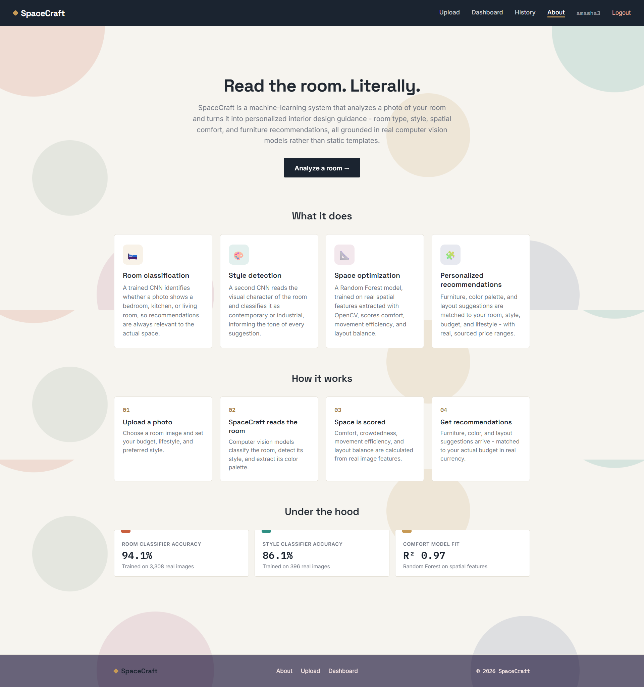
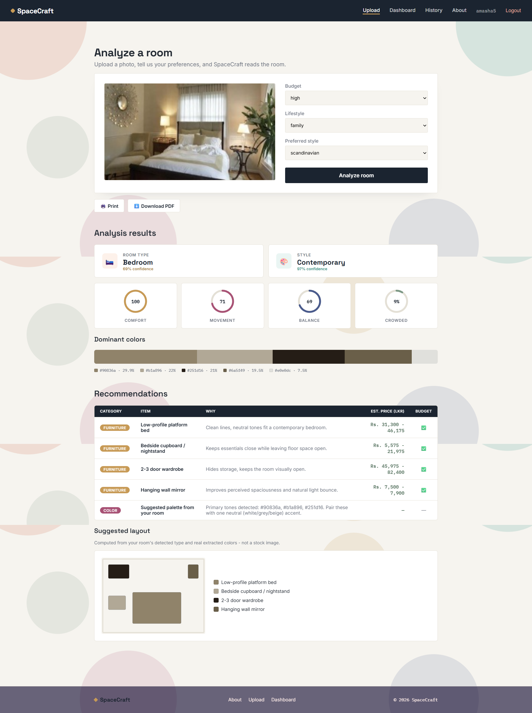

# SpaceCraft

**ML-Based Personalized Interior Design and Space Optimization System**

SpaceCraft analyzes a photograph of an existing room and generates personalized interior design recommendations grounded in genuine spatial analysis — not just aesthetic suggestions. It combines two custom-trained CNNs, a Random Forest comfort-scoring model, and K-Means color extraction into a full-stack web application with real, localized furniture pricing.

Unlike commercial platforms (Coohom, Planner 5D, Houzz, Interior AI), SpaceCraft discloses its real, evaluated model accuracy to the user and quantifies a room's *functional usability* — comfort, movement efficiency, layout balance, and crowdedness — not just how a design looks.

---

## Table of Contents

- [Features](#features)
- [Tech Stack](#tech-stack)
- [Model Performance](#model-performance)
- [Screenshots](#screenshots)
- [Project Structure](#project-structure)
- [Getting Started](#getting-started)
- [API Documentation](#api-documentation)
- [Testing](#testing)
- [Docker](#docker)
- [Deployment](#deployment)
- [Roadmap](#roadmap)
- [Known Limitations](#known-limitations)
- [License](#license)

---

## Features

- 🔐 **Secure authentication** — JWT-based, bcrypt-hashed passwords
- 📸 **Room photo upload** — with budget, lifestyle, and style preferences
- 🧠 **Room type classification** — custom-trained CNN (94.1% validation accuracy)
- 🎨 **Interior style classification** — custom-trained CNN (86.1% validation accuracy)
- 📐 **Space optimization scoring** — comfort, crowdedness, movement efficiency, layout balance (Random Forest, R² 0.97)
- 🎨 **Real dominant color extraction** — K-Means clustering with genuine per-color percentages
- 🛋️ **Personalized recommendations** — real, sourced LKR pricing, matched to your stated budget
- 📊 **Dashboard** — history and aggregate statistics with charts
- 📄 **PDF/print export** — download a full analysis report
- ✅ **Fully tested** — 17 automated tests, CI pipeline on every push
- 🐳 **Containerized** — Docker Compose for one-command local deployment

## Tech Stack

**Frontend**
- React (Vite), React Router
- Chart.js, jsPDF + html2canvas
- Custom design system (no UI framework)

**Backend**
- FastAPI, SQLAlchemy, SQLite
- JWT authentication, bcrypt

**Machine Learning**
- TensorFlow / Keras — MobileNetV2 transfer learning (both CNNs)
- scikit-learn — Random Forest (comfort scoring), K-Means (color extraction)
- OpenCV — feature extraction

**DevOps**
- Git / GitHub, GitHub Actions (CI/CD)
- Docker, Docker Compose
- Deployed via GitHub Pages (frontend) + Render / FastAPI Cloud (backend)

## Model Performance

| Model | Task | Result | Notes |
|---|---|---|---|
| Room Classifier | 3-class CNN (bedroom/kitchen/living_room) | **94.1%** validation accuracy | Trained on 3,308 real images |
| Style Classifier | 2-class CNN (contemporary/industrial) | **86.1%** validation accuracy | Redesigned from an original 50.6% (4-class) result via confusion matrix analysis — see [training README](backend/app/ml/training/README.md) |
| Comfort Model | Random Forest Regressor | **R² 0.97** | Trained on OpenCV-extracted spatial features |
| Color Extraction | K-Means Clustering | Unsupervised | Runs live per image, real pixel-proportion percentages |

All models are genuinely trained (not third-party APIs) and their real, honest accuracy is disclosed — including a documented negative result (a fine-tuning experiment that reduced accuracy to 38.0%) that directly informed the final model design.

## Screenshots





## Project Structure

```
spacecraft/
├── backend/
│   ├── app/
│   │   ├── api/            # auth, upload, predict, recommend, dashboard routes
│   │   ├── models/          # SQLAlchemy: User, Upload, Prediction
│   │   ├── schemas/         # Pydantic request/response schemas
│   │   ├── services/        # auth_service, recommendation_engine
│   │   └── ml/
│   │       ├── room_classifier.py
│   │       ├── style_predictor.py
│   │       ├── comfort_model.py
│   │       ├── color_extractor.py
│   │       ├── models/       # trained .h5 / .pkl (gitignored)
│   │       └── training/      # training scripts + README
│   ├── tests/                  # pytest suite
│   ├── Dockerfile
│   └── requirements.txt
├── frontend/
│   ├── src/
│   │   ├── pages/               # Login, Register, Upload, Dashboard, History, About
│   │   ├── components/           # Navbar, Footer, StatRing, RecommendationTable, etc.
│   │   ├── context/                # AuthContext
│   │   └── api/                     # backend API client
│   ├── Dockerfile
│   └── package.json
├── .github/workflows/           # CI and deployment pipelines
├── docker-compose.yml
└── README.md
```

## Getting Started

### Prerequisites
- Python 3.10 or 3.11
- Node.js 18 or 20 LTS
- Git

### Backend Setup

```bash
cd backend
python -m venv venv
source venv/bin/activate        # Windows: venv\Scripts\Activate.ps1
pip install -r requirements.txt
cp .env.example .env
python -m app.ml.training.train_comfort_model    # trains the comfort model (fast, ~seconds)
uvicorn app.main:app --reload --port 8000
```
Visit `http://localhost:8000/docs` for interactive API documentation.

### Frontend Setup

```bash
cd frontend
npm install
cp .env.example .env
npm run dev
```
Visit `http://localhost:5173`.

### Training the Real CNNs (optional)

The room and style classifiers use a heuristic fallback until trained. See [`backend/app/ml/training/README.md`](backend/app/ml/training/README.md) for full instructions on sourcing datasets and training on Google Colab (free GPU).

## API Documentation

Interactive Swagger docs are available at `/docs` once the backend is running. Summary:

| Method | Endpoint | Auth | Purpose |
|---|---|---|---|
| POST | `/api/auth/register` | No | Create a new account |
| POST | `/api/auth/login` | No | Authenticate, receive a JWT |
| GET | `/api/auth/me` | Yes | Current user profile |
| POST | `/api/upload` | Yes | Upload a room image + preferences |
| POST | `/api/predict/{upload_id}` | Yes | Run the full ML pipeline |
| GET | `/api/recommend/{prediction_id}` | Yes | Get recommendations |
| GET | `/api/dashboard/history` | Yes | Past predictions |
| GET | `/api/dashboard/summary` | Yes | Aggregate statistics |

## Testing

```bash
cd backend
python -m pytest tests/ -v
```
17 automated tests covering authentication and the recommendation engine's budget-matching logic (including a regression test for a real bug found and fixed during development). A GitHub Actions workflow runs this suite, plus a frontend build check, on every push.

## Docker

```bash
docker compose up --build
```
Backend: `http://localhost:8000` · Frontend: `http://localhost:5173`

## Deployment

- **Frontend:** deployed to GitHub Pages, auto-redeployed via GitHub Actions on every push
- **Backend:** deployed via [Render](https://render.com) or [FastAPI Cloud](https://fastapicloud.com), connected to this repository

## Roadmap

- [ ] Source training data for the "office" room type and "luxury" style categories
- [ ] Validate comfort scores against real human ratings (current model uses synthetic training labels)
- [ ] Lightweight object detection for furniture-level inventory
- [ ] Persistent cloud database (migrate from SQLite)
- [ ] Full WCAG accessibility audit
- [ ] Internationalization (i18n) support

## Known Limitations

- Room classifier covers 3 of 4 originally-proposed categories (office not yet supported)
- Style classifier covers 2 of 5 originally-proposed categories — consolidated from 5 to 2 based on confusion matrix evidence showing the original categories weren't reliably distinguishable (see [training README](backend/app/ml/training/README.md))
- Comfort model is trained on synthetic labels (no public "room comfort" ground-truth dataset exists) — a documented, honest limitation, not a bug
- SQLite database does not persist across restarts on some free-tier hosting platforms

## License

This project was developed as a final year academic project.

## Acknowledgments

- Room dataset: [emanhamed/Houses-dataset](https://github.com/emanhamed/Houses-dataset) (Ahmed & Moustafa, 2016)
- Room dataset: [Kaggle - Indoor Scenes CVPR 2019](https://www.kaggle.com/datasets/itsahmad/indoor-scenes-cvpr-2019)
- Style dataset: [Roboflow Universe - Interiordesign](https://universe.roboflow.com/class-qq9at/interiordesign) (CC BY 4.0)
- Furniture pricing: [Damro](https://damro.lk), Sri Lanka
